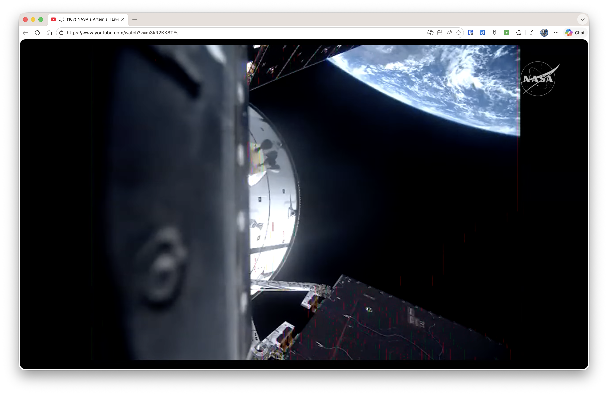

# Video Isolator

A Chrome extension that isolates video players by hiding everything else on the page. Click the extension icon to toggle — one click to isolate, another to restore.

### Before

### After

## Supported Sites

- **YouTube** — watch pages
- **x.com** — individual posts with video
- **Vimeo** — video pages
- **VictoryPlus.com** — video player pages

## Install

1. Clone or download this repo
2. Open `chrome://extensions/` in Chrome
3. Enable **Developer mode** (top right)
4. Click **Load unpacked** and select this folder
5. The extension icon appears in your toolbar

## Usage

1. Navigate to a supported site with a video
2. Click the extension icon — the video expands to fill the viewport
3. Click again to restore the original page

## How It Works

The extension uses a site registry that maps each supported site to a strategy for finding the video player element. For sites with stable DOM structures (YouTube, VictoryPlus), it uses CSS selectors. For sites with dynamic class names (x.com, Vimeo), it finds the `<video>` element and walks up the DOM to the appropriate container.

## Permissions

- **activeTab** — access the current tab when you click the icon
- **scripting** — inject the isolation script into the page
